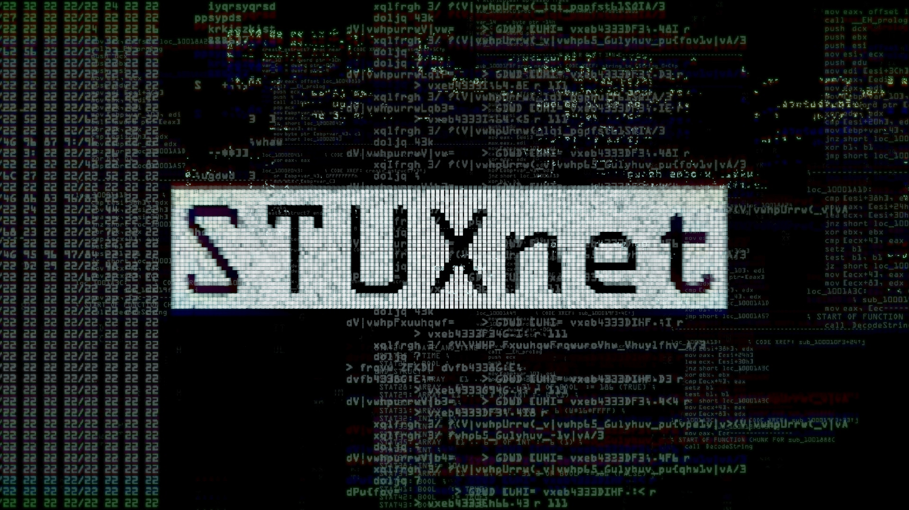
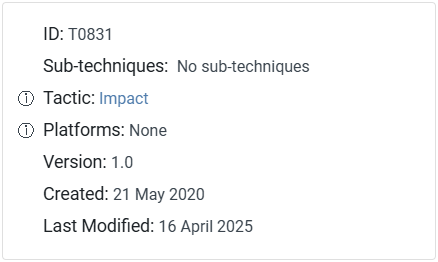
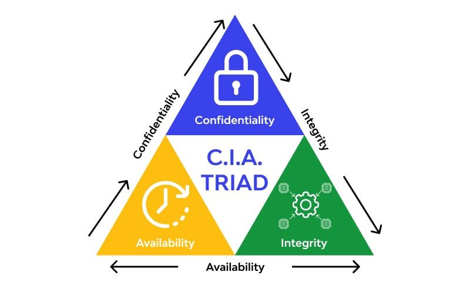

---

layout: default
title: Do You Remember Stuxnet?
-------------------------------

  
CYBERSECURITY · ICS · MITRE ATT&CK

  <h1>Do You Remember Stuxnet?</h1>

  

    A technical examination of Stuxnet, MITRE ATT&CK,
    and Manipulation of Control.
  

  

  
Parker Czyz · 2026

  

## What Is Stuxnet?

Stuxnet, first identified in 2010 by the infosec community, is a U.S. and Israeli government-developed tool intended to derail, or at least delay, the Iranian nuclear weapons development program. Stuxnet is a powerful computer worm targeted at an air-gapped facility that exploits multiple previously unknown Windows zero-days [1].

## How Is Stuxnet a MITRE ATT&CK Technique?

Stuxnet was the first publicly reported malware that specifically targeted industrial control systems devices. While Stuxnet uses over 60 MITRE ATT&CK techniques, the actions that caused physical damage were the specific manipulation of control – applying inappropriate command sequences and parameters – that caused damage to property [2][3]. There are three methods of manipulating control.

Methods for Manipulation of Control are man-in-the-middle attacks, spoofed command messages, and changing setpoints. A man-in-the-middle (MITM) attack is a cyberattack in which hackers intercept communications between two online targets to push commands, steal information, or perform actions by eavesdropping on communications between two online targets, such as a user and a web application [4]. Next, a spoof command message, more commonly known as Spoofing, is a cybercriminal activity in which a cybercriminal forges the sender’s information and pretends to be a legitimate source to gain access to personal information, money, or data [5]. Lastly, changing setpoints occurs when a cyber attacker changes the setpoint values of process variables normally set by operators or control systems, such as changing temperature, pressure, flow rate, or speed [3].

Stuxnet’s payload used a man-in-the-middle method to infect the programmable logic controller (PLC) systems that controlled the centrifuges, then changed setpoints to destroy enriched uranium. Specifically, Stuxnet gained access by infecting a computer running Siemens Step7 PLC programming; it then corrupted the Step7 software by changing any PLC program downloaded, so the code being programmed differed from the code being seen. Therefore, the “man” is the Step7 software that altered any PLC code the user tried to program/maintain before transferring it to the PLC [6]. The PLC program pushed to the centrifuge system would then increase the speed - changing the setpoints - of the centrifuge until the enriched uranium was destroyed.

  

### Methods of Manipulation of Control

Stuxnet was the first publicly reported malware that specifically targeted industrial control systems devices. While Stuxnet uses over 60 MITRE ATT&CK techniques, the actions that caused physical damage were the specific manipulation of control – applying inappropriate command sequences and parameters – that caused damage to property [2][3]. There are three methods of manipulating control.

Methods for Manipulation of Control are man-in-the-middle attacks, spoofed command messages, and changing setpoints. A man-in-the-middle (MITM) attack is a cyberattack in which hackers intercept communications between two online targets to push commands, steal information, or perform actions by eavesdropping on communications between two online targets, such as a user and a web application [4]. Next, a spoof command message, more commonly known as Spoofing, is a cybercriminal activity in which a cybercriminal forges the sender’s information and pretends to be a legitimate source to gain access to personal information, money, or data [5]. Lastly, changing setpoints occurs when a cyber attacker changes the setpoint values of process variables normally set by operators or control systems, such as changing temperature, pressure, flow rate, or speed [3].

| Method                       | Description                                                              |
| ---------------------------- | ------------------------------------------------------------------------ |
| **Man-in-the-Middle**        | Intercepts communications and manipulates information or commands.       |
| **Spoofed Command Messages** | Makes malicious commands appear to originate from a legitimate source.   |
| **Changing Setpoints**       | Changes process variables such as temperature, pressure, flow, or speed. |

## How Did Stuxnet Manipulate the Centrifuges?

Stuxnet’s payload used a man-in-the-middle method to infect the programmable logic controller (PLC) systems that controlled the centrifuges, then changed setpoints to destroy enriched uranium. Specifically, Stuxnet gained access by infecting a computer running Siemens Step7 PLC programming; it then corrupted the Step7 software by changing any PLC program downloaded, so the code being programmed differed from the code being seen. Therefore, the “man” is the Step7 software that altered any PLC code the user tried to program/maintain before transferring it to the PLC [6]. The PLC program pushed to the centrifuge system would then increase the speed - changing the setpoints - of the centrifuge until the enriched uranium was destroyed.

## Why is Stuxnet Important?

Traditionally, cyber-attacks are seen as criminal hacking into a system and stealing sensitive, personal information. However, Stuxnet opened the eyes of the general public that cyber-attacks can encompass more than just stealing data – that’s only a third of the CIA triad (confidentiality, integrity, and availability). Stuxnet struck the Iranian nuclear weapons development system’s integrity. For the U.S. and the Iranian governments to accomplish their mission, they did not have to steal the Iranian nuclear research to accomplish their missions, instead, the attack manipulated the integrity of the Iranian control system and caused physical damage.

  

### The CIA Triad

| Principle       | Meaning                                          |
| --------------- | ------------------------------------------------ |
| Confidentiality | Prevent unauthorized access to information       |
| **Integrity**   | Prevent unauthorized modification                |
| Availability    | Ensure systems and information remain accessible |

**Stuxnet demonstrated the physical consequences of compromising integrity.**

## How Does ICS Differ From IT?

Industrial control systems (ICS) control the automation and operation of critical infrastructure such as power plants, manufacturing lines, and water treatment facilities. ICS dictates how machines behave and respond to inputs and outputs. ICS Manipulation is rewriting or altering ICS code to make the system behave unexpectedly or destructively [7]. In contrast, IT refers to the computer systems, hardware, software, and networks that process and distribute data, including servers, routers, and applications that enable communication across the internet [8]. Therefore, IT covers data confidentiality as it moves through a system, and ICS covers data integrity.

| IT                                       | ICS                                               |
| ---------------------------------------- | ------------------------------------------------- |
| Primarily processes information          | Controls physical processes                       |
| Servers and applications                 | PLCs and control systems                          |
| Data may be the target                   | Physical processes may be affected                |
| Integrity compromise changes information | Integrity compromise can change physical behavior |

## Key Takeaway

Stuxnet demonstrated that cyberattacks do not have to be about stealing information.

They can manipulate the systems that control the physical world.

## References

[1] J. Fruhlinger, “Stuxnet explained: The first known cyberweapon,” CSO Online, Aug. 31, 2022. https://www.csoonline.com/article/562691/stuxnet-explained-the-first-known-cyberweapon.html

[2] “Stuxnet, Software S0603 | MITRE ATT&CK®.” https://attack.mitre.org/software/S0603/

[3] “Manipulation of Control, Technique T0831 - ICS | MITRE ATT&CK®.” https://attack.mitre.org/techniques/T0831/

[4] G. L. M. Kosinski, “What is a man-in-the-middle (MITM) attack?,” Nov. 17, 2025. https://www.ibm.com/think/topics/man-in-the-middle

[5] “What is spoofing?,” Cisco, Jun. 12, 2026. https://www.cisco.com/site/us/en/learn/topics/security/what-is-spoofing.html

[6] T. R. Kuphaldt, “The Stuxnet virus,” Cyber-security in Industrial Measurement and Control Systems | Textbook, Dec. 02, 2019. https://control.com/textbook/instrumentation-cyber-security/stuxnet/?utm_source=chatgpt.com

[7] S. D. Team, “ICS Logic Manipulation: Essential guide for System Security,” Startup Defense, Jun. 21, 2026. https://www.startupdefense.io/cyberattacks/ics-logic-manipulation

[8] “What is IT? Information technology explained,” Cisco, May 21, 2026. https://www.cisco.com/site/us/en/learn/topics/networking/what-is-information-technology-it.html

https://chatgpt.com/share/6aa4aac3-ab20-83ea-b264-846c13842950
